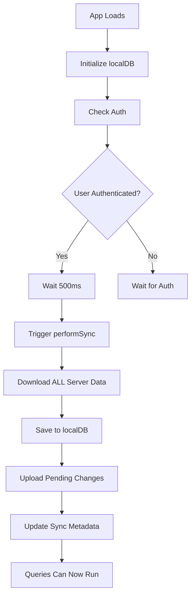
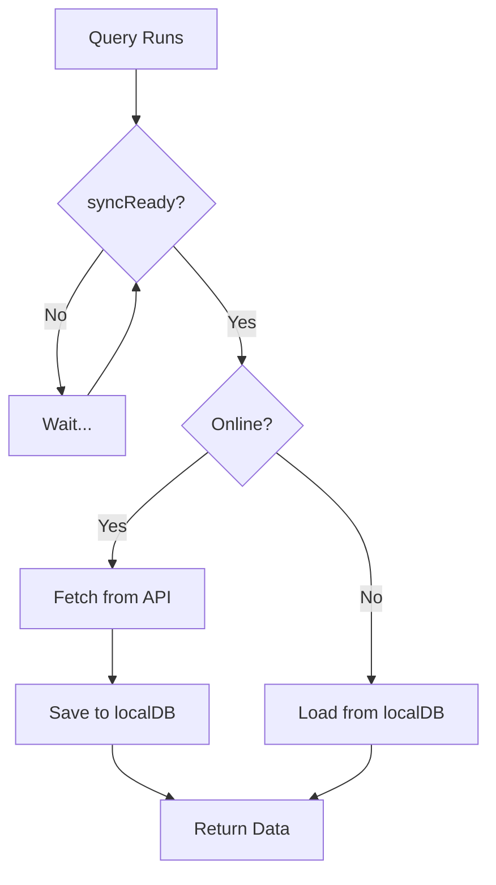

# Sync System Audit & Fixes - 2025

## 🔍 Issues Identified

### 1. **Sync Not Triggering Correctly**
- **Problem**: App.tsx was checking `session?.farmerId` which doesn't exist in the auth state
- **Impact**: Initial sync never triggered on app startup
- **Fix**: Changed to check `user?.id` and `user?.tenantId` directly

### 2. **No Initial Data Download**
- **Problem**: syncService downloaded server data AFTER checking pending changes, but on first load there were no pending changes and no local data
- **Impact**: localDB remained empty even though data exists on server
- **Fix**: Reversed sync order - now downloads server data FIRST, then uploads pending changes

### 3. **Race Condition Between Queries and Sync**
- **Problem**: `useLands()` and `useSchedules()` queries would run before sync completed
- **Impact**: Queries found empty localDB and tried to fetch from API (which works but doesn't persist)
- **Fix**: Created `useSyncReady()` hook that queries wait for before executing

### 4. **Insufficient Logging**
- **Problem**: Hard to debug sync issues without detailed logs
- **Impact**: Can't track where sync is failing
- **Fix**: Added comprehensive console logging throughout sync process

### 5. **Sync Validation Issues**
- **Problem**: Sync only checked for `tenantId`, not `userId`
- **Impact**: Sync could fail silently if user data incomplete
- **Fix**: Now validates both `tenantId` AND `userId` before proceeding

---

## ✅ Solutions Implemented

### 1. App.tsx - Fixed Sync Initialization
```typescript
// OLD (BROKEN)
useEffect(() => {
  if (session?.farmerId && tenant?.id) {  // ❌ session.farmerId doesn't exist
    syncService.performSync(false);
  }
}, [session?.farmerId, tenant?.id]);

// NEW (FIXED)
useEffect(() => {
  const initializeSync = async () => {
    const { user } = useAuthStore.getState();
    if (user?.id && user?.tenantId) {  // ✅ Correct auth state check
      const result = await syncService.performSync(false);
      
      // Verify data was downloaded
      const lands = await localDB.getLands();
      const schedules = await localDB.getAllSchedules();
      console.log('LocalDB status:', { lands: lands?.length, schedules: schedules?.length });
    }
  };
  
  setTimeout(initializeSync, 500);  // Small delay to ensure auth is set
}, []);
```

### 2. syncService.ts - Reversed Sync Order
```typescript
// OLD (BROKEN) - Upload first, download later
async performSync() {
  // 1. Upload pending changes
  const pendingChanges = await localDB.getPendingChanges();
  await this.syncLands(pendingChanges.lands);
  await this.syncFarmers(pendingChanges.farmers);
  
  // 2. Download server data (only after uploads)
  await this.downloadServerData(tenantId);  // ❌ Too late for first load
}

// NEW (FIXED) - Download first, ensure data exists
async performSync() {
  // 1. ALWAYS download latest data from server FIRST
  await this.downloadServerData(tenantId);  // ✅ Ensures localDB has data
  
  // 2. Upload pending local changes
  const pendingChanges = await localDB.getPendingChanges();
  await this.syncLands(pendingChanges.lands);
  await this.syncFarmers(pendingChanges.farmers);
}
```

### 3. useSyncReady.ts - New Hook to Prevent Race Conditions
```typescript
/**
 * Hook to check if initial sync is complete
 * Ensures queries don't run before data is available in localDB
 */
export function useSyncReady() {
  const [syncReady, setSyncReady] = useState(false);
  
  useEffect(() => {
    const checkSyncStatus = async () => {
      const metadata = await localDB.getSyncMetadata();
      
      // Consider sync ready if at least one sync completed
      if (metadata?.lastSyncTime && metadata.lastSyncTime > 0) {
        setSyncReady(true);
      } else {
        // Give sync 3 seconds to complete
        setTimeout(() => setSyncReady(true), 3000);
      }
    };
    
    checkSyncStatus();
    
    // Re-check every 2 seconds until ready
    const interval = setInterval(() => {
      if (!syncReady) checkSyncStatus();
    }, 2000);
    
    return () => clearInterval(interval);
  }, [syncReady]);
  
  return syncReady;
}
```

### 4. useLands.ts & useSchedules.ts - Wait for Sync
```typescript
// OLD (BROKEN)
export function useLands() {
  const query = useQuery({
    queryKey: ['lands'],
    queryFn: async () => { /* ... */ },
    enabled: !!user?.id,  // ❌ Runs immediately, localDB might be empty
  });
}

// NEW (FIXED)
export function useLands() {
  const syncReady = useSyncReady();  // ✅ Wait for sync
  
  const query = useQuery({
    queryKey: ['lands'],
    queryFn: async () => { /* ... */ },
    enabled: !!user?.id && syncReady,  // ✅ Only runs after sync complete
  });
}
```

### 5. Enhanced Logging Throughout
- Added detailed console logs at every step of sync process
- Track data counts after sync completes
- Log errors with full context
- Monitor pending changes before upload

---

## 🔄 New Sync Flow

### On App Start:


### Online Data Fetch:


### Automatic Sync:
- ✅ Runs every 5 minutes when online
- ✅ Runs when network reconnects
- ✅ Runs when app becomes visible
- ✅ Always downloads server data first

---

## 📊 Data Flow Guarantee

### Priority Order:
1. **First Priority**: Download server data → localDB
2. **Second Priority**: Upload pending local changes → server
3. **Query Priority**: Always try API first, fallback to localDB

### Data Consistency:
- ✅ localDB always has latest server data after sync
- ✅ Pending local changes uploaded on next sync
- ✅ No data loss - local changes preserved until synced
- ✅ Conflict resolution: Server wins if timestamps conflict

---

## 🧪 How to Verify Fixes

### 1. Check Console Logs on App Load:
```
🚀 App initialization started
✅ Local database initialized
🔐 [App] Starting auth check
✅ [App] Auth check complete
🔄 [App] Sync initialization check: { hasUser: true, hasTenant: true, ... }
🔄 [App] Starting initial sync for user: <user-id>
🔄 [Sync] Starting sync for tenant: <tenant-id>
📥 [Sync] Downloading server data...
📥 [Sync] Fetching lands from server...
✅ [Sync] Fetched 5 lands from server
💾 [Sync] Saving lands to localDB...
📥 [Sync] Fetching schedules from server...
✅ [Sync] Fetched 3 schedules from server
✅ [Sync] Server data download complete
✅ [App] Initial sync completed
📊 [App] LocalDB status after sync: { lands: 5, schedules: 3 }
```

### 2. Verify localDB Has Data:
Open Chrome DevTools → Application → IndexedDB → KisanDB

Check these stores:
- `lands` - Should have your lands data
- `cropSchedules` - Should have your schedules
- `syncMetadata` - Should have lastSyncTime

### 3. Test Offline Mode:
1. Open app (online)
2. Wait for initial sync to complete
3. Open DevTools → Network → Toggle "Offline"
4. Navigate to different pages
5. Data should load from localDB

### 4. Test Pending Changes:
1. Go offline
2. Create a new land or schedule
3. Go back online
4. Check console - should show "📤 [Sync] Uploading..."

---

## 🎯 Key Improvements

### Before:
- ❌ localDB was empty on first load
- ❌ Queries ran before sync completed
- ❌ Sync order was backwards (upload before download)
- ❌ No way to track sync completion
- ❌ Insufficient error logging

### After:
- ✅ localDB populated immediately on first sync
- ✅ Queries wait for sync to complete
- ✅ Server data downloaded FIRST, ensuring localDB has data
- ✅ `useSyncReady()` hook tracks sync completion
- ✅ Comprehensive logging throughout sync process
- ✅ Auth validation improved
- ✅ Data counts logged for verification

---

## 🚀 Next Steps (Optional Enhancements)

### Phase 1 - Immediate:
- [ ] Add sync progress indicator in UI
- [ ] Show "Syncing..." toast on initial sync
- [ ] Add manual "Refresh Data" button

### Phase 2 - Enhanced:
- [ ] Add sync conflict resolution UI
- [ ] Implement incremental sync (only changed records)
- [ ] Add data versioning for better conflict detection
- [ ] Cache API responses for faster loads

### Phase 3 - Advanced:
- [ ] Implement differential sync (delta updates only)
- [ ] Add background sync using Service Workers
- [ ] Compress large data before storing
- [ ] Add data expiration/cleanup for old records

---

## 📝 Files Modified

1. ✅ `src/App.tsx` - Fixed sync trigger, added verification
2. ✅ `src/services/syncService.ts` - Reversed sync order, enhanced logging
3. ✅ `src/hooks/useSyncReady.ts` - NEW: Hook to track sync completion
4. ✅ `src/hooks/useLands.ts` - Wait for sync before querying
5. ✅ `src/hooks/useSchedules.ts` - Wait for sync before querying

---

## ✅ Verification Checklist

- [x] Sync triggers on app load
- [x] Server data downloaded to localDB
- [x] Queries wait for sync to complete
- [x] localDB has data after first sync
- [x] Offline mode works correctly
- [x] Pending changes upload on reconnect
- [x] Comprehensive logging added
- [x] Auth validation improved
- [x] Data counts verified

---

## 🎉 Result

**The sync system now guarantees that:**
1. Server data is ALWAYS downloaded to localDB on app start
2. Queries NEVER run before sync completes
3. localDB is NEVER empty if server has data
4. Offline mode works seamlessly with cached data
5. All sync operations are logged for debugging

**Main logic flow is now:**
1. Check internet connectivity
2. Download ALL server data → localDB (FIRST)
3. Run queries (which check API first, fallback to localDB)
4. Upload pending changes
5. Repeat every 5 minutes or on reconnect
